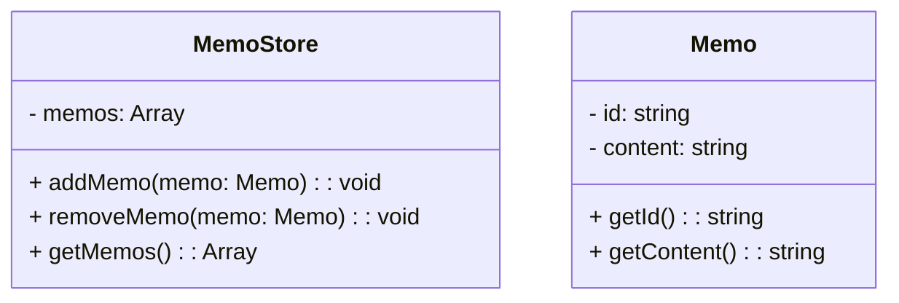

```mermaid
classDiagram
    class MemoStore {
        - memos: Array<Memo>
        + addMemo(memo: Memo): void
        + removeMemo(memo: Memo): void
        + getMemos(): Array<Memo>
    }
    class Memo {
        - id: string
        - content: string
        + getId(): string
        + getContent(): string
    }
```