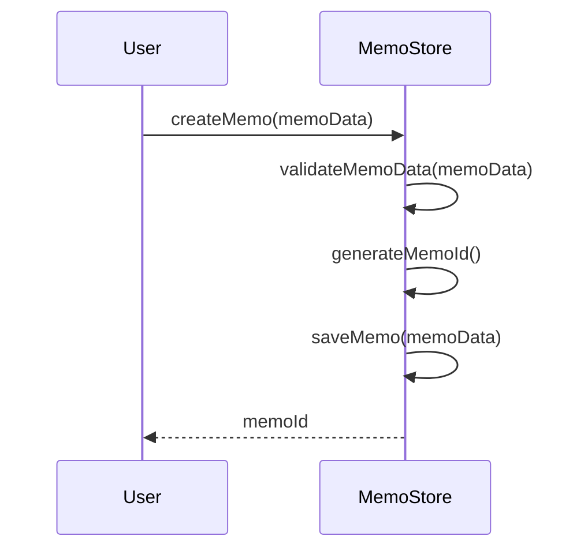

```mermaid
sequenceDiagram
    participant User
    participant MemoStore

    User->>MemoStore: createMemo(memoData)
    MemoStore->>MemoStore: validateMemoData(memoData)
    MemoStore->>MemoStore: generateMemoId()
    MemoStore->>MemoStore: saveMemo(memoData)
    MemoStore-->>User: memoId
```