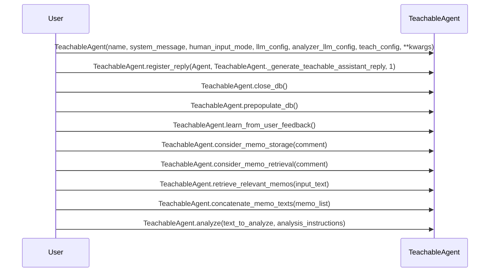

```mermaid
sequenceDiagram
    participant User
    participant TeachableAgent

    User->>TeachableAgent: TeachableAgent(name, system_message, human_input_mode, llm_config, analyzer_llm_config, teach_config, **kwargs)
    User->>TeachableAgent: TeachableAgent.register_reply(Agent, TeachableAgent._generate_teachable_assistant_reply, 1)
    User->>TeachableAgent: TeachableAgent.close_db()
    User->>TeachableAgent: TeachableAgent.prepopulate_db()
    User->>TeachableAgent: TeachableAgent.learn_from_user_feedback()
    User->>TeachableAgent: TeachableAgent.consider_memo_storage(comment)
    User->>TeachableAgent: TeachableAgent.consider_memo_retrieval(comment)
    User->>TeachableAgent: TeachableAgent.retrieve_relevant_memos(input_text)
    User->>TeachableAgent: TeachableAgent.concatenate_memo_texts(memo_list)
    User->>TeachableAgent: TeachableAgent.analyze(text_to_analyze, analysis_instructions)
```