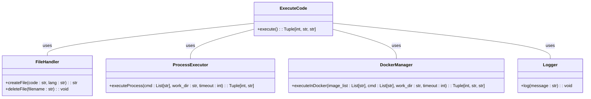
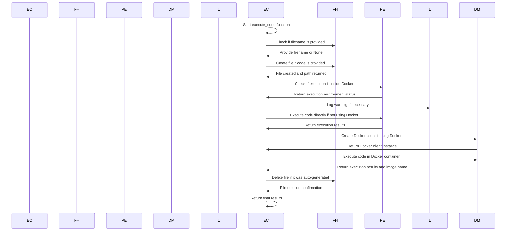

# Your role
- Expert Python Developer
- Expert in SOLID principles of software design and use of GoF Design Patterns
- My helpful assistant
- You understand that my attention span is limited and you need to be able to explain things with as few words as possible

# Your tasks
- Thoroughly analyze the code below.
- Create a mermaid sequence diagram for the code below.

# The Python code
```python
def execute_code(
    code: Optional[str] = None,
    timeout: Optional[int] = None,
    filename: Optional[str] = None,
    work_dir: Optional[str] = None,
    use_docker: Optional[Union[List[str], str, bool]] = docker is not None,
    lang: Optional[str] = "python",
) -> Tuple[int, str, str]:
    """Execute code in a docker container.
    This function is not tested on MacOS.

    Args:
        code (Optional, str): The code to execute.
            If None, the code from the file specified by filename will be executed.
            Either code or filename must be provided.
        timeout (Optional, int): The maximum execution time in seconds.
            If None, a default timeout will be used. The default timeout is 600 seconds. On Windows, the timeout is not enforced when use_docker=False.
        filename (Optional, str): The file name to save the code or where the code is stored when `code` is None.
            If None, a file with a randomly generated name will be created.
            The randomly generated file will be deleted after execution.
            The file name must be a relative path. Relative paths are relative to the working directory.
        work_dir (Optional, str): The working directory for the code execution.
            If None, a default working directory will be used.
            The default working directory is the "extensions" directory under
            "path_to_autogen".
        use_docker (Optional, list, str or bool): The docker image to use for code execution.
            If a list or a str of image name(s) is provided, the code will be executed in a docker container
            with the first image successfully pulled.
            If None, False or empty, the code will be executed in the current environment.
            Default is True, which will be converted into a list.
            If the code is executed in the current environment,
            the code must be trusted.
        lang (Optional, str): The language of the code. Default is "python".

    Returns:
        int: 0 if the code executes successfully.
        str: The error message if the code fails to execute; the stdout otherwise.
        image: The docker image name after container run when docker is used.
    """
    assert code is not None or filename is not None, "Either code or filename must be provided."
    timeout = timeout or DEFAULT_TIMEOUT
    original_filename = filename
    if WIN32 and lang in ["sh", "shell"]:
        lang = "ps1"
    if filename is None:
        code_hash = md5(code.encode()).hexdigest()
        # create a file with a automatically generated name
        filename = f"tmp_code_{code_hash}.{'py' if lang.startswith('python') else lang}"
    if work_dir is None:
        work_dir = WORKING_DIR
    filepath = os.path.join(work_dir, filename)
    file_dir = os.path.dirname(filepath)
    os.makedirs(file_dir, exist_ok=True)
    if code is not None:
        with open(filepath, "w") as fout:
            fout.write(code)
    # check if already running in a docker container
    in_docker_container = os.path.exists("/.dockerenv")
    if not use_docker or in_docker_container:
        # already running in a docker container
        cmd = [
            sys.executable if lang.startswith("python") else _cmd(lang),
            f".\\{filename}" if WIN32 else filename,
        ]
        if WIN32:
            logging.warning("SIGALRM is not supported on Windows. No timeout will be enforced.")
            result = subprocess.run(
                cmd,
                cwd=work_dir,
                capture_output=True,
                text=True,
            )
        else:
            signal.signal(signal.SIGALRM, timeout_handler)
            try:
                signal.alarm(timeout)
                # run the code in a subprocess in the current docker container in the working directory
                result = subprocess.run(
                    cmd,
                    cwd=work_dir,
                    capture_output=True,
                    text=True,
                )
                signal.alarm(0)
            except TimeoutError:
                if original_filename is None:
                    os.remove(filepath)
                return 1, TIMEOUT_MSG, None
        if original_filename is None:
            os.remove(filepath)
        if result.returncode:
            logs = result.stderr
            if original_filename is None:
                abs_path = str(pathlib.Path(filepath).absolute())
                logs = logs.replace(str(abs_path), "").replace(filename, "")
            else:
                abs_path = str(pathlib.Path(work_dir).absolute()) + PATH_SEPARATOR
                logs = logs.replace(str(abs_path), "")
        else:
            logs = result.stdout
        return result.returncode, logs, None

    # create a docker client
    client = docker.from_env()
    image_list = (
        ["python:3-alpine", "python:3", "python:3-windowsservercore"]
        if use_docker is True
        else [use_docker]
        if isinstance(use_docker, str)
        else use_docker
    )
    for image in image_list:
        # check if the image exists
        try:
            client.images.get(image)
            break
        except docker.errors.ImageNotFound:
            # pull the image
            print("Pulling image", image)
            try:
                client.images.pull(image)
                break
            except docker.errors.DockerException:
                print("Failed to pull image", image)
    # get a randomized str based on current time to wrap the exit code
    exit_code_str = f"exitcode{time.time()}"
    abs_path = pathlib.Path(work_dir).absolute()
    cmd = [
        "sh",
        "-c",
        f"{_cmd(lang)} {filename}; exit_code=$?; echo -n {exit_code_str}; echo -n $exit_code; echo {exit_code_str}",
    ]
    # create a docker container
    container = client.containers.run(
        image,
        command=cmd,
        working_dir="/workspace",
        detach=True,
        # get absolute path to the working directory
        volumes={abs_path: {"bind": "/workspace", "mode": "rw"}},
    )
    start_time = time.time()
    while container.status != "exited" and time.time() - start_time < timeout:
        # Reload the container object
        container.reload()
    if container.status != "exited":
        container.stop()
        container.remove()
        if original_filename is None:
            os.remove(filepath)
        return 1, TIMEOUT_MSG, image
    # get the container logs
    logs = container.logs().decode("utf-8").rstrip()
    # commit the image
    tag = filename.replace("/", "")
    container.commit(repository="python", tag=tag)
    # remove the container
    container.remove()
    # check if the code executed successfully
    exit_code = container.attrs["State"]["ExitCode"]
    if exit_code == 0:
        # extract the exit code from the logs
        pattern = re.compile(f"{exit_code_str}(\\d+){exit_code_str}")
        match = pattern.search(logs)
        exit_code = 1 if match is None else int(match.group(1))
        # remove the exit code from the logs
        logs = logs if match is None else pattern.sub("", logs)

    if original_filename is None:
        os.remove(filepath)
    if exit_code:
        logs = logs.replace(f"/workspace/{filename if original_filename is None else ''}", "")
    # return the exit code, logs and image
    return exit_code, logs, f"python:{tag}"
```
### classDiagram


### sequenceDiagram


###

# Entities Explanation

## 1. ExecuteCode (EC)

This represents the main function `execute_code`, which orchestrates the entire process of code execution.

**Responsibilities**:
- Parse and validate the input parameters.
- Determine the mode of execution: directly or within a Docker container.
- Coordinate with other entities to handle file operations, direct code execution, Docker-based execution, and logging.
- Return the execution results.

## 2. FileHandler (FH)

This is a conceptual representation of the file handling aspects within the `execute_code` function.

**Responsibilities**:
- If a filename is not provided and the code is available, it's responsible for generating a file with a unique name and writing the code to this file.
- After execution, if the file was auto-generated, it's responsible for deleting this file.

## 3. ProcessExecutor (PE)

This represents the direct code execution aspect using the `subprocess` module in the function.

**Responsibilities**:
- Determine if the current execution is already inside a Docker container.
- If direct execution is chosen (i.e., not using Docker), it is responsible for executing the code using the `subprocess` module and returning the results.

## 4. DockerManager (DM)

This is a conceptual representation of the Docker-related operations in the `execute_code` function.

**Responsibilities**:
- Establish a connection with Docker using the Docker client.
- Pull the necessary Docker image if it's not available locally.
- Create a Docker container with the appropriate configurations and execute the code inside it.
- Handle the results of the Docker-based execution and return them.
- Manage the Docker container lifecycle (start, monitor, stop, and remove).

## 5. Logger (L)

This represents the logging mechanism in the function.

**Responsibilities**:
- Log warnings or informational messages at appropriate stages in the execution. For instance, if running on Windows and the code is a shell script, a warning is logged indicating that certain features might not be available.

---

Together, these entities encapsulate the different aspects of the `execute_code` function's operation, ensuring the code is executed as per the provided parameters and in the specified environment.

