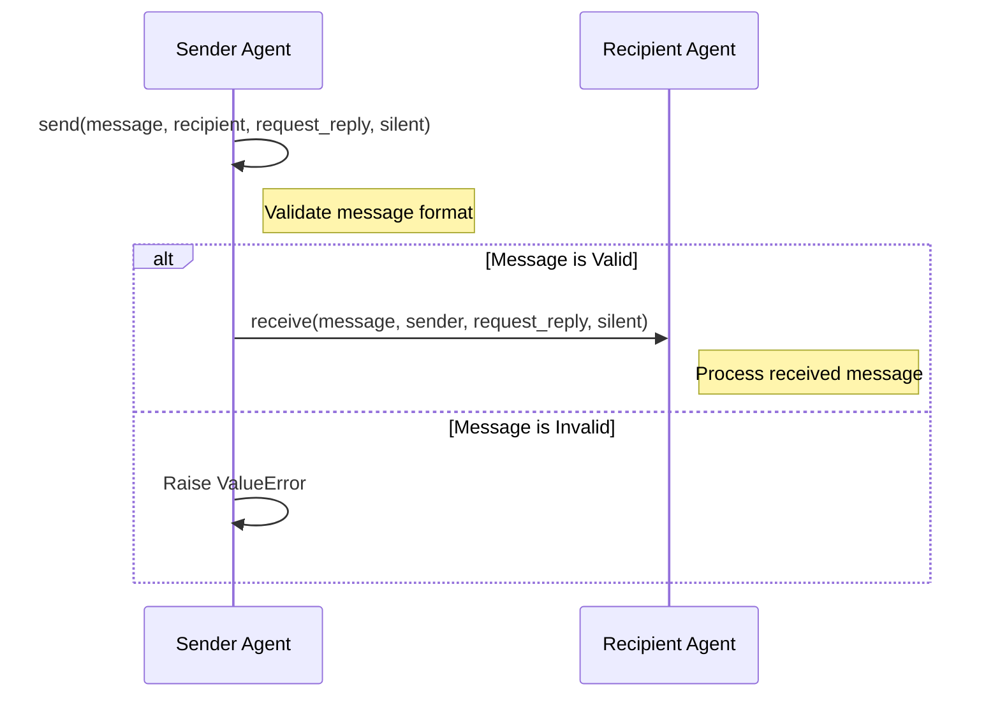

# Your role
- Expert Python Developer
- Expert in SOLID principles of software design and use of GoF Design Patterns
- My helpful assistant
- You understand that my attention span is limited and you need to be able to explain things with as few words as possible

# Your tasks
- Thoroughly analyze the code below.
- Please rewrite the comment that shows when you hover over the method name.  I don't even understand it.
- Create a mermaid sequence diagram for the code below.

# The Python code
```python
def send(
        self,
        message: Union[Dict, str],
        recipient: Agent,
        request_reply: Optional[bool] = None,
        silent: Optional[bool] = False,
    ) -> bool:
        """Send a message to another agent.

        Args:
            message (dict or str): message to be sent.
                The message could contain the following fields (either content or function_call must be provided):
                - content (str): the content of the message.
                - function_call (str): the name of the function to be called.
                - name (str): the name of the function to be called.
                - role (str): the role of the message, any role that is not "function"
                    will be modified to "assistant".
                - context (dict): the context of the message, which will be passed to
                    [Completion.create](../oai/Completion#create).
                    For example, one agent can send a message A as:
        ```python
        {
            "content": lambda context: context["use_tool_msg"],
            "context": {
                "use_tool_msg": "Use tool X if they are relevant."
            }
        }
        ```
                    Next time, one agent can send a message B with a different "use_tool_msg".
                    Then the content of message A will be refreshed to the new "use_tool_msg".
                    So effectively, this provides a way for an agent to send a "link" and modify
                    the content of the "link" later.
            recipient (Agent): the recipient of the message.
            request_reply (bool or None): whether to request a reply from the recipient.
            silent (bool or None): (Experimental) whether to print the message sent.

        Raises:
            ValueError: if the message can't be converted into a valid ChatCompletion message.
        """
        # When the agent composes and sends the message, the role of the message is "assistant"
        # unless it's "function".
        valid = self._append_oai_message(message, "assistant", recipient)
        if valid:
            recipient.receive(message, self, request_reply, silent)
        else:
            raise ValueError(
                "Message can't be converted into a valid ChatCompletion message. Either content or function_call must be provided."
            )
```

